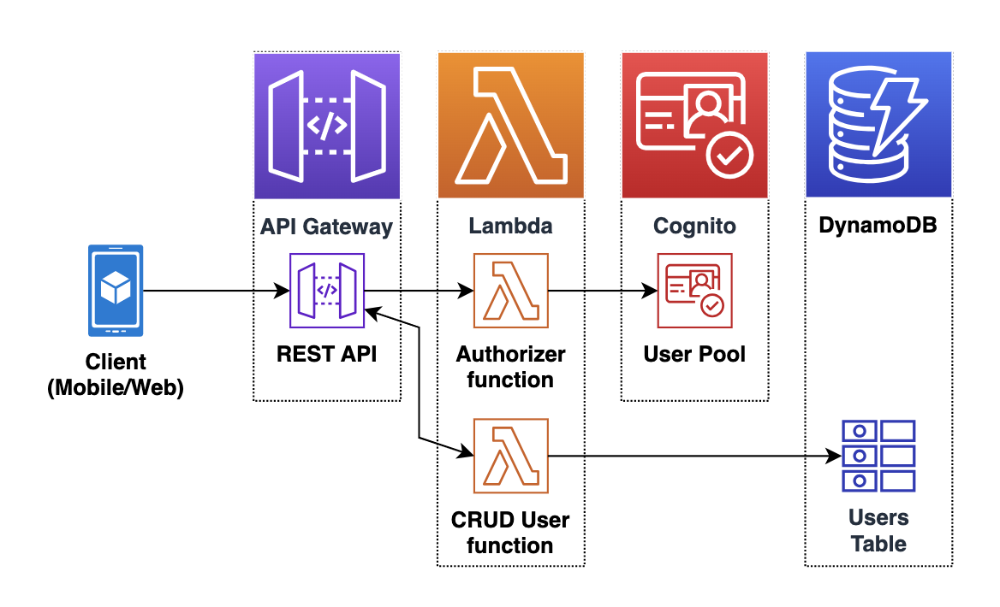
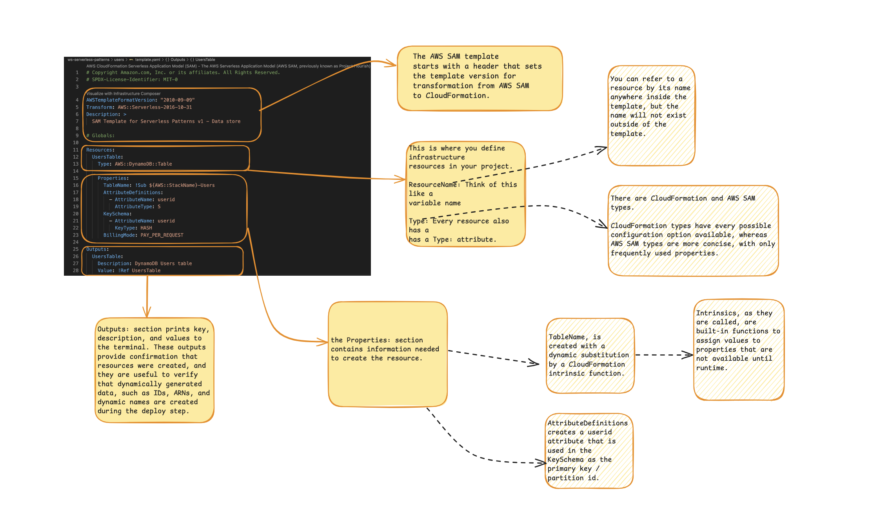

# Build Serverless Production Application

## Reference



### Build and Deploy the Project

1. Use the cookiecutter file to initialize the project structure.

    ```sh
    sam init --name "ws-serverless-patterns" --location "https://ws-assets-prod-iad-r-iad-ed304a55c2ca1aee.s3.us-east-1.amazonaws.com/76bc5278-3f38-46e8-b306-f0bfda551f5a/module2/sam-python/sam-cookiecutter-2023-11-03.zip"

    cd ws-serverless-patterns

    rm samconfig.toml

    cd ./users
    ```

1. Sam Template Description
    

1. Build the Project

    ```sh
    cd ~/environment/ws-serverless-patterns/users
    sam build
    ```

    - The sam build command processes your `AWS SAM template file`, `application code`, and any applicable `language-specific files` and `dependencies`. 
    - The command also copies build artifacts in the format and location expected for subsequent steps in your workflow. 
    - You specify dependencies in a manifest file that you include in your application, such as requirements.txt for Python functions, or package.json for Node.js functions.

1. Deploy the Project

    ```sh
    sam deploy --guided --stack-name ws-serverless-patterns-users
    ```

1. Add Business Logic

    ```sh
    UsersFunction:
        Type: AWS::Serverless::Function
        Properties:
        Handler: src/api/users.lambda_handler
        Description: Handler for all users related operations
        Environment:
            Variables:
            USERS_TABLE: !Ref UsersTable
        Policies:
            - DynamoDBCrudPolicy:
                TableName: !Ref UsersTable
        Tags:
            Stack: !Sub "${AWS::StackName}"
    ```

By convention, the name of the Lambda event handler function is lambda_handler. The handler property is the path to the Users.py file, but the suffix ".py" has been replaced with the function handler name ("lambda_handler"). This will become clearer when you later create the Lambda function.