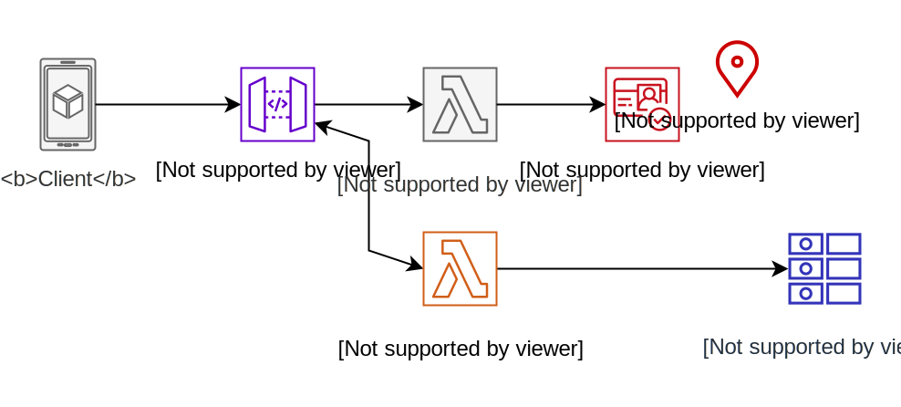

# Build Serverless Production Application

## Reference


### Build and Deploy the Project

1. Use the cookiecutter file to initialize the project structure.

    ```sh
    sam init --name "ws-serverless-patterns" --location "https://ws-assets-prod-iad-r-iad-ed304a55c2ca1aee.s3.us-east-1.amazonaws.com/76bc5278-3f38-46e8-b306-f0bfda551f5a/module2/sam-python/sam-cookiecutter-2023-11-03.zip"

    cd ws-serverless-patterns

    rm samconfig.toml

    cd ./users
    ```

1. Sam Template Description
    

1. Build the Project

    ```sh
    cd ~/environment/ws-serverless-patterns/users
    sam build
    ```

    - The sam build command processes your `AWS SAM template file`, `application code`, and any applicable `language-specific files` and `dependencies`. 
    - The command also copies build artifacts in the format and location expected for subsequent steps in your workflow. 
    - You specify dependencies in a manifest file that you include in your application, such as requirements.txt for Python functions, or package.json for Node.js functions.

1. Deploy the Project

    ```sh
    sam deploy --guided --stack-name ws-serverless-patterns-users
    ```

1. Add Business Logic

    ```sh
    UsersFunction:
        Type: AWS::Serverless::Function
        Properties:
        Handler: src/api/users.lambda_handler
        Description: Handler for all users related operations
        Environment:
            Variables:
            USERS_TABLE: !Ref UsersTable
        Policies:
            - DynamoDBCrudPolicy:
                TableName: !Ref UsersTable
        Tags:
            Stack: !Sub "${AWS::StackName}"
    ```

By convention, the name of the Lambda event handler function is lambda_handler. The handler property is the path to the Users.py file, but the suffix ".py" has been replaced with the function handler name ("lambda_handler"). This will become clearer when you later create the Lambda function.


### 2 - Test SAM Locally

This shows how you can run the Lambda function from IDE with sam local invoke. Running the function locally provides fast unit testing, but it is best practice to also perform integration tests.

1. Login to ECR public registry

    ```sh
      aws ecr-public get-login-password --region us-east-1 | docker login --username AWS --password-stdin public.ecr.aws
    ```

1. Events are created to test each resource and path in the application. check `~/environment/ws-serverless-patterns/users/events/event-post-user.json`

1. Test Function locally

    To do this, run the Lambda function from IDE with `sam local invoke`.

    ```sh
    DOCKER_HOST=unix:///Users/a/.docker/run/docker.sock sam local invoke -e events/event-post-user.json -n env.json
    ```

    When you run this, AWS SAM builds an image. 

### 3 - Connect an API

- To track requests through the application, X-Ray tracing is enabled with the TracingEnabled attribute. The tag attribute provides additional meta data for reporting and aggregating activity for this stack and the API.

- The RestAPI event is added to UsersFunction. Now, each request to the API endpoint will invoke UsersFunction. 

- `sam build && sam deploy`

- `export API_ENDPOINT=$(aws cloudformation describe-stacks --stack-name ws-serverless-patterns-users --output text --query "Stacks[0].Outputs[?OutputKey=='APIEndpoint'].OutputValue")
echo "API endpoint: $API_ENDPOINT"`

- Make request to the API using `curl $API_ENDPOINT/users`

### 3.1 - Create User Pool



For the API authentication and authorization, you will use a Lambda Authorizer function in API Gateway. An Amazon Cognito User Pool will be used for the user directory. The pool will require two attributes for each user: name & email.

Amazon Cognito provides user sign-up, sign-in, and access control. It supports sign-in with social identity providers and enterprise identity providers via SAML 2.0 and OpenID Connect.

- A `client` and `domain` for the user pool, and a group to specify admin-level users will be created.

### 3.2 - Secure the API

- Set up an authorizer function which can be quickly modified to enable any OpenID Connect (OIDC) compliant IdP to provide authentication and authorization for your API.

- To do this, you will create a custom Lambda authorizer function (authorizer.py) that uses JWT-based authorization and dynamically generates security policies for the API. This approach can be used for 3rd party IdPs - Okta, Ping, Auth0, and others, with minimal changes.

- When invoked, the authorizer function will validate the token in the API request and extract the principal ID. The function will then use the principal ID (a GUID in this case) to restrict access to the resources specific to that user. The authorizer also checks the principal ID is a member of the Amazon Cognito user pool group apiAdmins.


